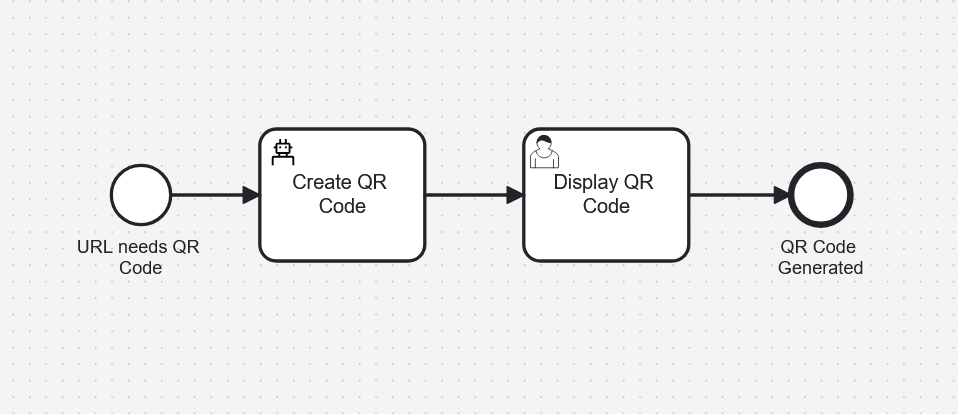

# Generate a QR Code using RPA and Camunda
This is an example project that integarate a Camunda 8 BPMN Process with a Robot Framework RPA bot. 

## What Does this project do

This project is started with a form that asks you to add a URL `https://camunda.com/contact/`. From there a BPMN process is kicked off. The first task then activates an RPA bot that opens a web browser, goes to `https://www.qrcode-monkey.com/` and generates a QR Code for the URL in question. It then sends an image of hte QR Code back to the process where a user task displays the QR Code for all to enjoy. 

## What are the components

### Tools To Build and Run
1. Camunda Desktop Modeler
    1. Building the RPA Script
1. RPA Worker
    1. Running & Testing the RPA Script
1. Camunda 8 SaaS 
    1. Building and Excuting the BPMN Model

### Artifacts in this repo
1. `getData.rpa` - This is the script given to the worker with the instructions on how to get the QR Code
1. `Enter URL.form` & `Display QR Code.form` - These are just web forms which get data from the user for the bot to use and also show the restuls of the rpa bot's adventure in cyberspace!
1. `Generate QR Code.bpmn` - This is the BPMN Process that holds the variables and the state as well as orchestrating the other components

## Setup and Pre-Requisits

There are some things you need to get started with RPA. luckily, it's all [detailed here](https://docs.camunda.io/docs/8.7/components/rpa/getting-started/), but in short your'll need the following

1. [Create a C8 SaaS account](https://modeler.camunda.io/) and setup a cluster.

1. [Download the modeler](https://camunda.com/download/modeler/)

1. [Download and install the rpa worker](https://github.com/camunda/rpa-worker/releases)

## Creating and Adding Creds

This project requires two API keys from your Camunda SaaS account. Instructions on how to create an [API Key are here](https://docs.camunda.io/docs/8.7/components/console/manage-clusters/manage-api-clients/). The two keys are needed for the following

1. API Key for Worker.

    This is used by the workers to get work and complete it, so that i can be integreated into BPMN processes. It needs access to **Zeebe**. Details on how to setup the creds on your [modeler are here. ](https://docs.camunda.io/docs/components/modeler/desktop-modeler/connect-to-camunda-8/)
1. API Key for Modeler.

    This is used by the Desktop Modeler to deploy scripts to your SaaS cluster. It needs access to **Zeebe** and **Secrets**.  Details on how to add the key to the works are [found in the readme.](https://github.com/camunda/rpa-worker/releases)

## Runing The Project

### The Process

1. Go to the Camunda Web Modeler, create a new project and upload the `Generate QR Code.bpmn` file. 
1. Upload the `Enter URL.form` & `Display QR Code.form` files to the same directory. 
1. Deploy the process to your Camunda cluster

### The RPA Bot

1. Open the RPA Worker properties file and enable zeebe access.  `camunda.client.zeebe.enabled=true`. Then run the worker
1. Go the Camunda Desktop Modeler and open the `getData.rpa` file. You should see "✅ RPA worker Connected" at the bottom of the modeler
1. Deploy the `getData.rpa`. 

### Run the Process
1. Go to Camunda 8 SaaS tasklist and in the process section find the `Generate QR Code` process and click "Start Process". 
1. Enter a URL into the frontend
1. Wait for the worker to complete it's work. 
1. See in Tasklist a Usertask will apper showing the QR code.
